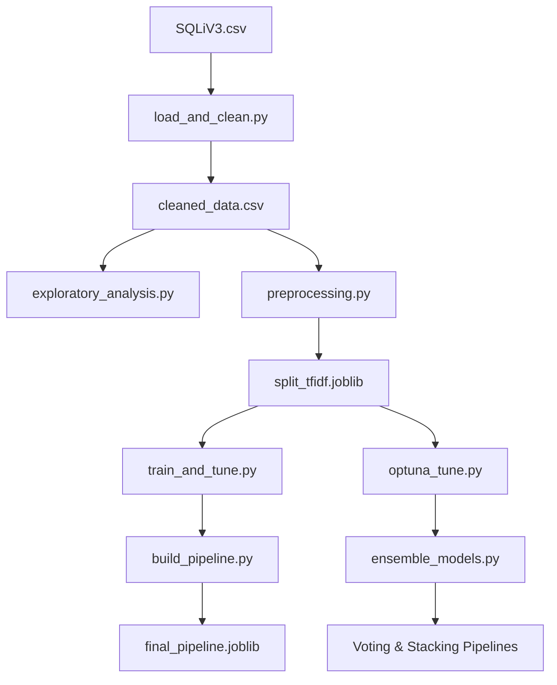

# Détection d'Injections SQL (SQLi) par Machine Learning

Ce projet implémente un pipeline complet d'apprentissage automatique (Machine Learning) pour classifier et détecter des requêtes SQL malveillantes (injections SQL) à partir de payloads de requêtes. Le projet couvre le nettoyage des données, l'analyse exploratoire, le traitement de texte (TF-IDF), l'optimisation des hyperparamètres (Optuna) et la création de modèles d'ensemble (Voting & Stacking).

---

## 🚀 Architecture du Pipeline

Le projet est structuré en plusieurs modules exécutables dans un ordre logique :



### 1. Préparation & Analyse des Données
*   **[load_and_clean.py](file:///c:/Users/utiliser/Downloads/injection-sql-main/injection-sql-main/Projet_injection_sql/load_and_clean.py)** : Charge le jeu de données brut (`SQLiV3.csv`), identifie automatiquement les colonnes de texte et de labels, nettoie les caractères non imprimables, normalise les labels (0 pour sain, 1 pour attaque) et supprime les doublons.
*   **[exploratory_analysis.py](file:///c:/Users/utiliser/Downloads/injection-sql-main/injection-sql-main/Projet_injection_sql/exploratory_analysis.py)** : Génère des statistiques textuelles (longueur des requêtes, entropie de Shannon, n-grams de caractères) et effectue un clustering K-Means pour visualiser les groupes de structures SQL.

### 2. Prétraitement & Vectorisation
*   **[preprocessing.py](file:///c:/Users/utiliser/Downloads/injection-sql-main/injection-sql-main/Projet_injection_sql/preprocessing.py)** : Sépare les données en ensembles d'entraînement et de test stratifiés, applique des techniques de rééquilibrage de classes si nécessaire, et ajuste un vectoriseur TF-IDF au niveau des caractères (n-grams de 3 à 6 caractères) pour capturer les signatures syntaxiques des injections SQL.

### 3. Entraînement & Optimisation
*   **[train_and_tune.py](file:///c:/Users/utiliser/Downloads/injection-sql-main/injection-sql-main/train_and_tune.py)** : Entraîne des modèles de base (Régression Logistique, Forêt Aléatoire, XGBoost) avec une recherche aléatoire (`RandomizedSearchCV`) et calibre les probabilités prédites.
*   **[optuna_tune.py](file:///c:/Users/utiliser/Downloads/injection-sql-main/injection-sql-main/optuna_tune.py)** : Utilise l'optimiseur **Optuna** pour trouver les hyperparamètres maximisant le score F1.
*   **[ensemble_models.py](file:///c:/Users/utiliser/Downloads/injection-sql-main/injection-sql-main/ensemble_models.py)** : Combine les meilleurs classificateurs optimisés par Optuna dans un **VotingClassifier** (vote soft) et un **StackingClassifier** (avec un méta-apprenant de Régression Logistique).

### 4. Déploiement
*   **[build_pipeline.py](file:///c:/Users/utiliser/Downloads/injection-sql-main/injection-sql-main/build_pipeline.py)** : Assemble le vectoriseur TF-IDF et le meilleur modèle entraîné dans un unique objet `Pipeline` Scikit-Learn exportable pour utilisation directe en production.

---

## 🛠️ Installation et Configuration

1. **Cloner le dépôt** :
   ```bash
   git clone https://github.com/votre-username/injection-sql.git
   cd injection-sql
   ```

2. **Créer et activer un environnement virtuel** :
   ```bash
   python -m venv .venv
   # Sur Windows:
   .venv\Scripts\activate
   # Sur macOS/Linux:
   source .venv/bin/activate
   ```

3. **Installer les dépendances** :
   ```bash
   pip install -r requirements.txt
   ```

---

## 💻 Guide d'Utilisation

### Étape 1 : Nettoyer le jeu de données
Placez votre fichier `SQLiV3.csv` à la racine ou dans le dossier `Projet_injection_sql/` puis lancez :
```bash
python Projet_injection_sql/load_and_clean.py
```
Le fichier nettoyé sera sauvegardé sous `data/processed/cleaned_data.csv`.

### Étape 2 : Lancer l'analyse exploratoire
```bash
python Projet_injection_sql/exploratory_analysis.py
```
Les graphiques et rapports statistiques seront générés dans `data/processed/analysis/`.

### Étape 3 : Effectuer le prétraitement et la vectorisation TF-IDF
```bash
python Projet_injection_sql/preprocessing.py
```
Cela produit le fichier vectorisé `data/processed/split_tfidf.joblib`.

### Étape 4 : Entraîner et optimiser les modèles
Vous pouvez utiliser la recherche aléatoire rapide :
```bash
python train_and_tune.py
```
Ou lancer l'optimisation fine avec Optuna :
```bash
python optuna_tune.py --n_trials 60
```

### Étape 5 : Créer les modèles d'ensemble
Combinez les modèles entraînés par Optuna pour de meilleures performances :
```bash
python ensemble_models.py
```

### Étape 6 : Exporter le pipeline de production
```bash
python build_pipeline.py
```
Le pipeline complet est sauvegardé sous `data/processed/models/final_pipeline.joblib`.

### Étape 7 : Lancer l'interface de démo interactive
Vous pouvez lancer une application web interactive pour tester les payloads SQLi en temps réel :
```bash
streamlit run demo_app.py
```
*Note : Si le modèle de Machine Learning n'est pas encore entraîné localement, l'application basculera automatiquement sur un détecteur heuristique par défaut afin de rester immédiatement utilisable.*

---


## 🔮 Exemple d'utilisation en Production

Une fois le pipeline exporté, vous pouvez charger le fichier `.joblib` et prédire directement si une requête est saine (0) ou malveillante (1) :

```python
import joblib

# Charger le pipeline final
pipeline = joblib.load("data/processed/models/final_pipeline.joblib")

# Requêtes à tester
payloads = [
    "SELECT * FROM users WHERE id = 12",
    "SELECT * FROM users WHERE id = 1 OR 1=1 --",
    "admin' OR '1'='1"
]

# Prédictions
predictions = pipeline.predict(payloads)
proba = pipeline.predict_proba(payloads)[:, 1]

for query, pred, prob in zip(payloads, predictions, proba):
    status = "MALICIEUX (SQLi)" if pred == 1 else "SAIN"
    print(f"Requête : {query}\nStatut : {status} (Probabilité d'attaque : {prob:.4f})\n")
```